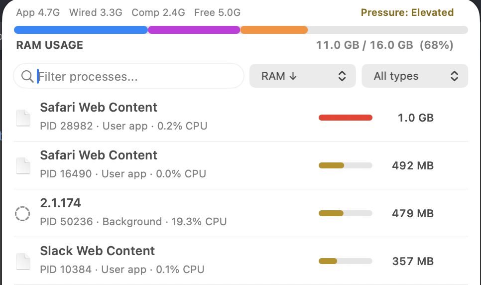
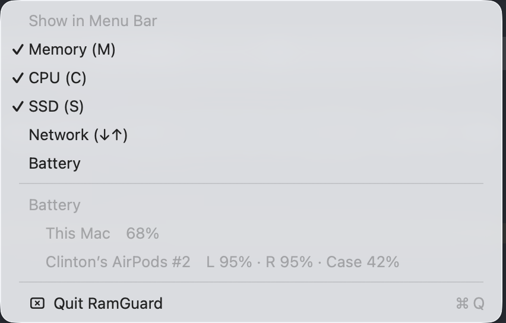

# RamGuard — Lightweight macOS Menu Bar System Monitor

RamGuard is a fast, minimalist **macOS menu bar system monitor** for RAM, CPU, disk, network, and battery — with a built-in process manager that lets you actually *kill* what's hogging your memory, not just watch it. Native Swift, zero dependencies, ~288KB binary, ~18MB running.

> **At a glance:** real-time RAM / CPU / SSD / network / battery in your menu bar, a searchable process list you can kill from, optional local-AI cleanup suggestions, and a runtime footprint small enough that the monitor never becomes the problem it's monitoring.

   

<p align="center">
  
</p>

<p align="center">
  
  &nbsp;
  
</p>

> **Left-click** for the process list (search, sort, kill). **Right-click** to toggle which metrics show in the menu bar and to read battery for this Mac and connected Apple devices — including AirPods (left, right, and case).

---

## Why RamGuard

Most system monitors are built to *show you everything*. RamGuard is built on a narrower idea: **a menu bar tool should be glanceable, weigh almost nothing, and let you act.**

- **Minimalist by default.** One compact readout — `M 81%` — and nothing else until you ask for more. Right-click to add CPU, SSD, or network. Turn off what you don't want; the bar shrinks to fit.
- **Genuinely lightweight.** A single ~288KB binary with no frameworks, no Electron, no background daemons. It holds around 18MB of RAM while running, and frees its view memory the moment you close the popover.
- **Action, not just observation.** RamGuard's reason to exist is the next step Activity Monitor makes slow: see what's eating your RAM, learn what it actually is, and end it — graceful quit or force, with a confirmation and a safety timer.
- **Private and offline.** No telemetry, no network calls, no account. The optional AI runs against a *local* Ollama model on your own machine — nothing leaves your Mac.
- **One file, plain `swiftc`.** No Xcode project, no package manager, no build graph. Read it, audit it, build it in one command.

RamGuard is intentionally not trying to be a dashboard with graphs, sensors, weather, and history. It's the tool you reach for when your fans spin up and you want to know *what* and *kill it* in five seconds.

---

## Features

### In the menu bar
- **Real-time readout** of RAM, CPU, SSD, network, and battery — each one **independently togglable** via right-click.
- **Compact labels** (`M` / `C` / `S` / `↓↑` / battery glyph) that take minimal horizontal space; hidden metrics don't reserve room.
- **Battery + connected devices** — optional battery percentage with a charge-aware icon; right-click lists battery for this Mac and connected Apple peripherals (AirPods, Magic Mouse/Trackpad/Keyboard).
- **Memory-pressure aware** — color shifts and optional notifications as pressure climbs.

### In the popover (left-click)
- **RAM overview bar** — segmented App / Wired / Compressed / Free breakdown with a live memory-pressure indicator.
- **Full process list** — every process with icon, name, PID, type, CPU%, and a RAM usage bar.
- **Search, sort, filter** — live search by name or PID; sort by RAM / CPU / name / PID / runtime; filter by User / System / Background / High-RAM.
- **Kill from the list** — click a process to reveal Kill (SIGTERM) / Force (SIGKILL) with inline confirmation and a 5-second auto-cancel. Protected system processes can't be killed.
- **"What is this process?"** — expand any row for a plain-English description (100+ built in); unknown ones get a one-click web lookup.
- **Copy footprint** — one click copies a full system snapshot (RAM breakdown, SSD, top processes) for pasting into a chat or AI.

### Optional local AI
- Connects to a **local [Ollama](https://ollama.com) model** (default `gemma3`) to classify processes as SAFE / CAUTION / CRITICAL with reasoning.
- Optional, opt-in auto-kill limited to background, non-protected processes, fully logged.
- Everything runs on-device — no cloud, no API key.

---

## Install

### Homebrew (recommended)

```bash
brew install clintoncodewell/tap/ramguard
```

This builds from source with `swiftc`, so there's no Gatekeeper prompt or quarantine step. Update later with `brew upgrade ramguard`.

After install, link it into `~/Applications` so it shows in Spotlight/Launchpad (the formula prints this too):

```bash
ln -sf "$(brew --prefix)/opt/ramguard/RamGuard.app" ~/Applications/RamGuard.app
open ~/Applications/RamGuard.app
```

### Download the app

Grab the latest `RamGuard.zip` from [**Releases**](https://github.com/clintoncodewell/ramguard/releases), unzip, and drag `RamGuard.app` to `/Applications`.

Because the app is open-source and ad-hoc signed (not notarized through a paid Apple Developer account), clear the download quarantine once:

```bash
xattr -dr com.apple.quarantine /Applications/RamGuard.app
open /Applications/RamGuard.app
```

(Or: try to open it, then approve it under **System Settings → Privacy & Security → Open Anyway**.)

### Build from source

Requires Xcode Command Line Tools (`xcode-select --install`).

```bash
git clone https://github.com/clintoncodewell/ramguard.git
cd ramguard
./build.sh
cp -R RamGuard.app /Applications/
open /Applications/RamGuard.app
```

RamGuard runs as a menu bar app — no Dock icon, no Cmd+Tab entry.

---

## Usage

- **Left-click** the menu bar item → open the popover (process list, search, kill, settings).
- **Right-click** the menu bar item → toggle which metrics show (Memory, CPU, SSD, Network) and Quit.
- **Click a process row** → expand its description, or reveal the kill controls.
- **Type in the search field** → live-filter by name or PID.

Want it to launch at login? **System Settings → General → Login Items → +** and add RamGuard.

---

## FAQ

**Is RamGuard free and open source?**
Yes — MIT licensed, single-file Swift, no paid tiers.

**How much memory does it use?**
About 18MB while running. The binary is ~268KB and it links no third-party frameworks.

**Does it work on Apple Silicon and Intel?**
Yes. Building from source compiles for your Mac. Pre-built release binaries currently target Apple Silicon — open an issue if you need a universal build.

**Can it kill or quit processes?**
Yes — that's the point. Click any process and choose graceful quit (SIGTERM) or force (SIGKILL). Protected system processes are blocked.

**Can I show CPU, network, disk, or battery in the menu bar too?**
Yes — right-click the menu bar item and toggle each metric on or off independently. Memory and SSD are on by default; CPU, network, and battery are off until you enable them.

**Can it show my MacBook battery and AirPods battery?**
Yes. Enable Battery from the right-click menu to show your Mac's battery percentage with a charge-aware icon. The right-click menu also lists battery levels for this Mac and connected Apple peripherals (AirPods, Magic Mouse, Magic Trackpad, Magic Keyboard).

**Does it send any data anywhere?**
No. No telemetry, no accounts, no network calls. The optional AI feature talks only to a local Ollama instance on your own machine.

**Does it need an account or internet connection?**
No. It reads system stats directly from the macOS kernel and runs entirely offline.

**Which macOS versions are supported?**
macOS 13 (Ventura) and later.

---

## Configuration

Config lives at `~/.config/ramguard/config.json` (human-editable; most options are also in Settings or the right-click menu).

| Key | Default | Description |
|-----|---------|-------------|
| `menuBarRAM` | `true` | Show RAM % in the menu bar |
| `menuBarCPU` | `false` | Show CPU % in the menu bar |
| `menuBarSSD` | `true` | Show SSD % in the menu bar |
| `menuBarNet` | `false` | Show network down/up rate in the menu bar |
| `menuBarBattery` | `false` | Show battery % (charge-aware icon) in the menu bar |
| `refreshInterval` | `2` | Seconds between refreshes (`2`/`5`/`10`/`30`) |
| `alertThreshold` | `80` | RAM % that triggers a notification |
| `showNotifications` | `true` | macOS notifications on high RAM |
| `maxProcesses` | `50` | Max process rows shown |
| `groupHelpers` | `true` | Merge helper/XPC processes under their parent app |
| `showCPU` | `true` | Show CPU% in process row metadata |
| `showThreads` | `false` | Show thread count in process row metadata |
| `aiEnabled` | `false` | Enable local Ollama AI analysis |
| `aiAutoKill` | `false` | Allow AI to auto-kill safe background processes |
| `aiModel` | `gemma3` | Ollama model name |
| `ollamaURL` | `http://localhost:11434` | Ollama server URL |

---

## Architecture

Everything lives in a single `main.swift` (~1100 lines). No Xcode project, no `Package.swift`, no storyboards, no SwiftUI.

```
ramguard/
├── main.swift     # All app logic
├── build.sh       # swiftc -Osize + strip
├── LICENSE
├── README.md
└── RamGuard.app/Contents/{Info.plist, MacOS/ramguard}
```

| Layer | Choice | Why |
|-------|--------|-----|
| Language | Swift | Native, fast, no runtime overhead |
| UI | AppKit (NSStatusItem + NSPopover) | Native menu bar integration, minimal memory |
| Layout | Manual frames | No AutoLayout overhead |
| Data | Mach APIs (`host_statistics64`, `proc_pidinfo`, `getifaddrs`) | Direct kernel calls, no shell-out |
| Build | `swiftc -Osize` + `strip` | No Xcode project needed |

**Data sources:** `host_statistics64(HOST_VM_INFO64)` for RAM, `host_statistics(HOST_CPU_LOAD_INFO)` tick deltas for system CPU, `getifaddrs()` byte-counter deltas for network rate, `FileManager`/`URLResourceValues` for disk, `IOPSCopyPowerSourcesList` + an in-process IORegistry sweep for battery, and `proc_listallpids` + `proc_pidinfo` for per-process data.

**Memory discipline:** icons cached per app, an autoreleasepool around the fetch loop, the process list and view hierarchy freed when the popover closes, and `malloc_zone_pressure_relief` to return dirty pages to the OS.

---

## Contributing

Issues and PRs welcome. The whole app is one readable file — start at the `// MARK:` headings. Keep the constraints: single file, plain `swiftc`, no SwiftUI, no AutoLayout, no third-party dependencies, and stay under ~20MB runtime footprint.

## License

[MIT](LICENSE) © 2026 Clinton Cunningham
